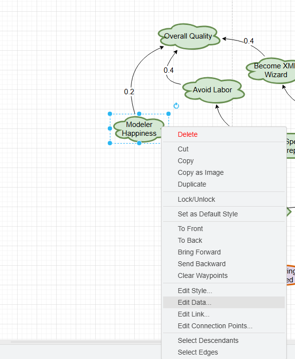

# Building iStarDT-V models

## Setting Up
- Open draw.io
- Create `New Diagram -> Blank Diagram`
- Follow the steps described in [README](../README.md) in order to load the iStarDT-V library. 
- Your working space should look as follows:

- Go to `File -> Properties`
- Make sure `Compressed` in unchecked
	- `mx2dtx` can only read uncompressed DRAWIO files.

## Drawing Models

- Drag and drop elements from the library. Double click to update their label.
	- Though the translator cleans HTML that draw.io adds to the label, it is better to avoid boldface, italics and carriage returns in the labels
- **Relationships must snap on the endpoints.** To achieve this, first drag the end point of the relationship over the element you wish to connect. Move the mouse around the shape and release your mouse button (drop) only when the teal-blue glow appears on the perimeter of the shape. 

**Step 1:** Move endpoint of relationship over the element, until the the teal-blue glow appears on the perimeter of the shape. 

 - **Step 2:** Release mouse to drop the end-point and connect the entity to the link. 

## Goals, Tasks and Effects
### Goal and Task Decomposition
- Create a hierarchy rooted on a (hard) goal, and AND- and OR-decomposed into other goals and eventually tasks.
- At the leaf level there should only be tasks and tasks cannot be further AND- and OR- decomposed. Ergo:
	- If you need to decompose a task replace it with a goal.
	- If you don't know how to further decompose a goal, turn it into a task.

### Adding pre and npr links
- When there are precedence constraints between goals and tasks they can just be added using the pre and npr links.
- Origins of pre/npr links can be: goals, tasks, effects, precondition boxes
- Destinations of pre/npr links: goals, tasks, effects

### Effects and Effect Groups
#### Adding effect groups
- Tasks are analyzed into effect groups.
- Simply drag an `Effect Group` from the iStarDT-V library and connect the eff link to the task. 
- Use the `Effect Group Link` and `Satisfying Effect` and `Non-Satisfying Effect` elements to expand an effect group with more effects.

#### Effects and predicates
There are two ways to use effects:
- **Default:** the effect's label is a `turnsTrue` predicate. The translator will take the label, convert it to camel case, and use it as a `turnsTrue` predicate.
- **Custom:** the effect contains lists of `turnsTrue` and `turnsFalse` predicates. These are specified in the effect's Data fields. 

- In Custom effects (i.e., if a non-empty `turnsTrue` or `turnsFalse` list is sensed) the label is not a useable identifier.
- To access, add, update `turnsTrue` or `turnsFalse` select the Effect in question, right-click and select `Edit Data...`
- In the fields `turnsFalse`, `turnsTrue` add comma separated lists of predicates that occurrence of the effect turns, respectively, true or false.
- Variables can be added as `variable := value`
- Click `Apply` to save and close.
- In draw.io, hovering over the element shows all the custom data fields, including `turnsFalse`, `turnsTrue` ones.
## Condition Boxes
Precondition elements can be used for creating formulae to serve as origins of (negative) precedence links. The grammar for preparing those formulae is as follows (and can be found in our accompanying paper):

Note that all identifiers in the formulae are camel-case representations of goals, tasks, predicates as well as variables and qualities (in the context of comparisons).
There are two ways to use condition boxes:
* **Use label:** just type the formula on the label.

* **Use custom data field:** if the formula is too complex or want to use an already precompiled iStarDT-X formula, use custom data properties, and fields, `formula` and `dtxFormula` respectively. The tool will consider the `Condition Box`'s label as an identifier.

## Qualities

### Adding Qualities and Contribution links
- A complete iStar-DT diagram must contain at least a `Quality`. 
- Qualities are the targets of `Contribution Links` from: goals, tasks, effects, condition boxes, other qualities.
- The label on the contribution link should be a numeric. It can be updated by simply selecting the `Contribution Link` and pressing `F2` or simply double-clicking on the number.
### Qualities and Formulae
- The value of a quality can be defined by either incoming contribution links or a formula.
- If there is a formula present, incoming contribution links are ignored.
- Currently pre-compiled iStarDT-X formulae can be added in the corresponding Data Field.
 

### Initialization, Exported Set and Cross-run Set
There are three additional boxes that need to be added to the diagram: an initialization set, an exported set and a cross-run set.

 

Each can be selected from the library and dropped into the diagram. 
#### Initialization Set
- Comma separated list of identifiers: predicates, variables and qualities, all in camel case format. Predicates are used as-is. Variables and qualities in the form `[identifier] := [constant]`, e.g. `avoidLabor := -0.5`
#### Exported Set
- Comma separated list of identifiers: predicates, variables, goals, tasks, qualities, all in camel case format.
- Variables and qualities are in the form `[identifier](minVal,maxVal)`, where `minVal` and `maxVal` are the minimum and maximum value of the variable or quality, e.g. `overallQuality(-1,1)`.
#### Cross-run Set
 - Comma separated list of identifiers. Predicates, variables, and qualities (camel-case representation). 
### Specifying Roots
* The diagram must contain a root goal and a root quality. While the translator will do its best to guess which one this is, it is optimal if it is explicitly specified.
* Simply select the goal/quality, `Right Click -> Edit Data...` and then set `isRoot` to `true`.
### Saving and Translating
* Save the diagram as an uncompressed DRAWIO file
* The file can be given as an input to the `mx2dtx` tool. See [README](../README.md) for directions.
* The translator will generate several information, warning, and possibly error messages. Study those to correct any errors or omissions.
* **Note:** the resulting iStarDT-X may contain features not supported yet by subsequent tools in the pipeline, including the [dtx2X](https://github.com/cmg-yorku/dtx2X) tool.. 

## Contact

- For bug reports and queries please contact [liaskos@yorku.ca](liaskos@yorku.ca).  
